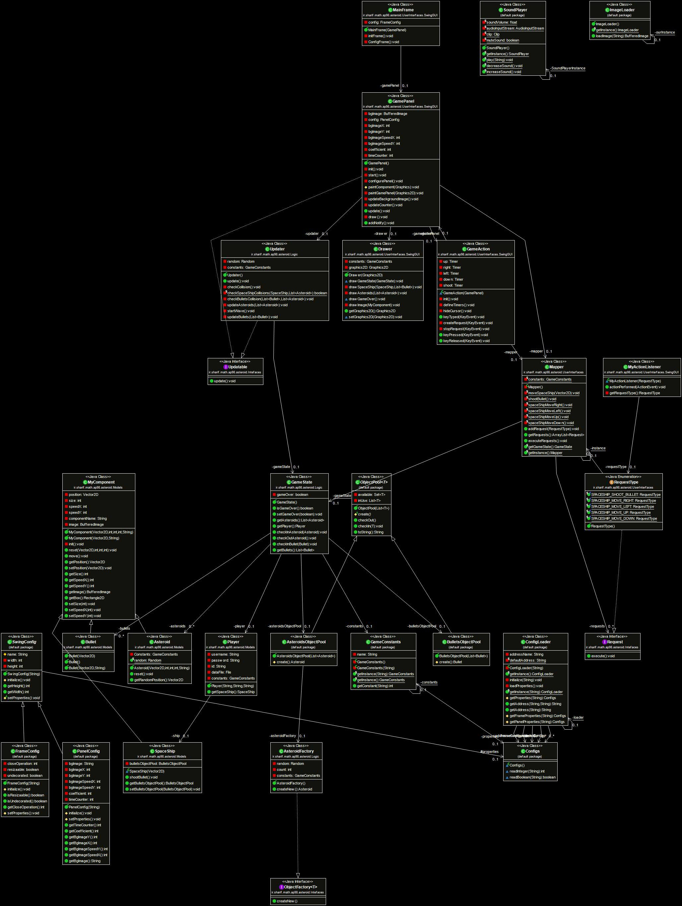

# Asteroids 
This code sample is made to serve as well designed, good and clean coded game in java for students of 
**Advanced Programming**  of **Sharif University of Technology**.

# Design Patterns
The code has implemented the following [design patterns](https://sourcemaking.com/design_patterns)
* [Singleton](https://www.javatpoint.com/singleton-design-pattern-in-java)
* [Factory](https://www.tutorialsteacher.com/ioc/dependency-injection)
* [Dependency Injection](https://sourcemaking.com/design_patterns)
* [Object Pool](https://www.javatpoint.com/object-pool-pattern)

There might also be some minor implementations of other design patterns.

# Design
While creating the project the following principals were considered:

1. A class should have one and only one reason to change, meaning that a class should have only one job.
2. Objects or entities should be open for extension, but closed for modification.
3. Let q(x) be a property provable about objects of x of type T. Then q(y) should be provable for objects y of type S where S is a subtype of T.
4. A client should never be forced to implement an interface that it doesn't use or clients shouldn't be forced to depend on methods they do not use.
5. Entities must depend on abstractions not on concretions. It states that the high level module must not depend on the low level module, but they should depend on abstractions.

These five principals are called the [**S.O.L.I.D**](https://scotch.io/bar-talk/s-o-l-i-d-the-first-five-principles-of-object-oriented-design)  principles of object oriented design.

# UML
Here is the **uml** of the game:

you can lean about uml's  [here](https://faranesh.com/blog/uml-tutorial)

# Contributors
* Hossein Boomeri
* Seyed Alireza Khadem 
* Sahel Mesforoush
* Farzin Nasiri

